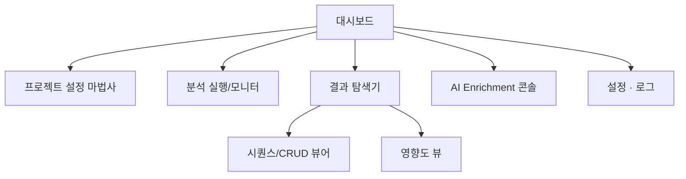
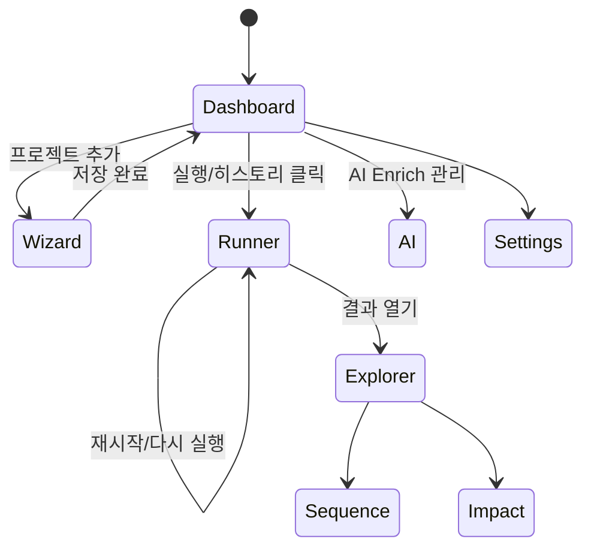

# CSA GUI 화면 설계서 (2025-11-07)

## 1. 화면 구조 개요
- 전역 레이아웃: 좌측 고정 내비게이션 + 상단 헤더 + 컨텐츠 패널 2열(주요 정보/세부 정보) 구조.
- 핵심 메뉴: 대시보드, 프로젝트 설정, 분석 실행, 결과 탐색, 시각화·리포트, AI Enrichment, 시스템 설정/로그.
- 상태 배지: Neo4j 연결, 분석 워커, AI 큐 상태를 헤더 우측에 지속 노출.

### 정보 구조 다이어그램


## 2. 공통 UI 가이드
- **레이아웃**: 12-column grid, 기본 gutter 16px, 최대 콘텐츠 폭 1440px.
- **타이포그래피**: Pretendard / Inter, Heading(20/18/16pt), Body(14pt), 코드/로그는 JetBrains Mono.
- **컬러 토큰**: Primary(Indigo 600), Success(Teal 500), Warning(Amber 500), Danger(Red 500), 배경은 두 단계 회색.
- **상호작용 패턴**: 모든 실행 버튼은 2단계 확인(파라미터 스냅샷 → 실행), 진행률은 Toast + Inline Progress Bar 동시 노출.
- **알림 정책**: 실패는 Sticky Toast + 로그 패널 자동 스크롤, 성공은 5초 Toast + 히스토리 카드 업데이트.
- **접근성**: 대비비 4.5:1 이상, 키보드 포커스 링 2px, 라이브 영역(로그/Progress)은 ARIA 적용.

## 3. 화면 설계
### 3.1 프로젝트 허브 & 대시보드
**목적**: 최근 실행 현황, 주요 경고, 프로젝트 단축키 제공.

| ID | 구성 | 설명 |
| --- | --- | --- |
| C1 | 프로젝트 카드 | 이름, 목적, 마지막 실행 시각, 기본 명령 바로가기 버튼 |
| C2 | 실행 히스토리 타임라인 | 최근 10건 상태(성공/실패), 클릭 시 로그 바로 열기 |
| C3 | Neo4j 상태 패널 | 연결 지연, DB명, 인덱스 상태, 재시도 버튼 |
| C4 | 빠른 실행 영역 | 사전 정의된 Analyze/Sequence 템플릿 버튼 + 파라미터 요약 |

**주요 상호작용**
- 카드 우측 `⋯` 메뉴에서 프로젝트 설정/복제/삭제.
- 히스토리 항목 클릭 시 분석 실행 화면의 해당 로그로 딥링크.
- Neo4j 오류 시 재시도 → 설정 모달 자동 포커스.

**와이어프레임 메모**
```
+--------------------------------------------------------------------------------+
| Header (프로젝트 선택 드롭다운 | 상태 배지 | 사용자 메뉴)                          |
+----------------------+---------------------------------------------------------+
| Sidebar              | Cards Row: [프로젝트 카드][Neo4j 상태][빠른 실행]         |
| Dashboard            | Timeline + 알림 패널                                     |
+----------------------+---------------------------------------------------------+
```

### 3.2 프로젝트 설정 마법사
**목적**: `.env` 생성, 소스/DB 경로, Neo4j 자격 증명 입력.

| 단계 | 입력 요소 | 검증/피드백 |
| --- | --- | --- |
| 1. 프로젝트 식별 | 프로젝트명, 설명, 출력 디렉터리 선택기 | 중복명 검사, 경로 존재 여부 표시 |
| 2. 소스 & DB | Java 소스 루트, DB 스크립트 경로, 스트리밍 옵션 | 경로 정합성, 디렉터리 사이즈 예측 |
| 3. Neo4j 연결 | URI, DB명, 계정/비밀번호, 연결 테스트 버튼 | 라이브 ping, TLS 여부 |
| 4. 분석 옵션 | Analyze 대상(ALL/Java/DB), DTO 스킵, AI 사용 여부 | 옵션 간 상호 제약 자동 경고 |
| 5. 요약 & 저장 | 생성될 `.env` diff, 실행 스크립트 미리보기 | 저장 후 바로 실행 여부 토글 |

**상호작용**
- 상단 Stepper로 이동, 미완료 단계는 경고 아이콘.
- 저장 시 백그라운드로 `.env`와 프로젝트 JSON 스냅샷 생성.

### 3.3 분석 실행 & 모니터
**목적**: Analyze/Impact 등 명령 실행, 큐 관리, 로그 스트리밍.

| 구역 | 내용 |
| --- | --- |
| 좌측 큐 패널 | 대기/실행/완료 리스트, 우선순위 드래그, 재시작 버튼 |
| 중앙 상단 | 파라미터 폼(명령, 옵션, 환경 선택) |
| 중앙 하단 | 실시간 Progress(퍼센트, ETA, 단계 로그) |
| 우측 | Raw 로그 뷰어, 필터(Info/Warning/Error), 다운로드 버튼 |

**와이어프레임**
```
+---------------------------------------------------------------+
| 파라미터 폼 (명령 선택, 옵션 태그, 저장된 프리셋)              |
+------------+-------------------------------+------------------+
| 작업 큐    | Progress & 단계 카드           | 로그 뷰어        |
|            |                                 | (검색, 고정폭)   |
+------------+-------------------------------+------------------+
```

**상호작용**
- 실행 시 큐 카드 생성 → Progress 패널이 해당 카드로 스크롤.
- 로그 뷰어는 10,000 라인 단위 가상스크롤, 검색 시 키워드 하이라이트.
- 긴급 중지는 큐 카드 `Stop` 버튼으로 제공, Tauri → FastAPI cancel API 호출.

### 3.4 결과 탐색기
**목적**: 분석 결과(그래프 통계, CRUD, 클래스 스펙) 탐색.

| 영역 | 세부 내용 |
| --- | --- |
| 필터 패널 | 프로젝트/빌드 버전, 태그(Controller/Entity/테이블) 필터, 검색 |
| 결과 그리드 | 카드/리스트 전환, 각 항목에 주요 메트릭(LOC, 복잡도) |
| 상세 패널 | 탭(개요, 호출 체인, SQL, 출력물 링크) |

**와이어프레임**
```
| Filter (좌) | Results Grid (중앙) | Detail Tabs (우) |
```

**상호작용**
- 리스트 항목 클릭 → 상세 패널 갱신, 관련 다이어그램 미리보기.
- 출력물 탭에서 Markdown/Excel 미리보기 + 다운로드.

### 3.5 시각화 · 리포트 센터
**목적**: Sequence, CRUD Matrix, Impact Diagram 생성/미리보기.

| 섹션 | 설명 |
| --- | --- |
| 템플릿 리스트 | 자주 쓰는 조합 저장, 태그/검색 |
| 미리보기 캔버스 | Mermaid/PlantUML 코드 블록 + 렌더 이미지 탭 |
| 내보내기 패널 | PNG/SVG/PDF 선택, 파일명 규칙, 저장 위치 |

**상호작용**
- 템플릿 클릭 시 파라미터 자동 로드 후 `Generate` 버튼 활성화.
- 캔버스에서 확대/축소, 다이어그램 새로고침 표시.

### 3.6 AI Enrichment 콘솔
**목적**: AI 설명 생성 상태 모니터, 큐 제어, 속도 튜닝.

| 구역 | 내용 |
| --- | --- |
| 요약 카드 | 처리 완료/대기/에러 카운트, 평균 소요 시간 |
| 큐 테이블 | 노드 타입, 클래스/메서드명, 재시도 버튼 |
| 동시성 조절 | 슬라이더(1~20), Rate limit 경고 |
| 로그 패널 | AI provider 응답 요약, 실패 이유 |

**상호작용**
- 큐 행 선택 시 상세 모달(원본 텍스트, AI 응답) 팝업.
- 동시성 슬라이더 변경 시 즉시 FastAPI API 호출.

### 3.7 시스템 설정 & 로그
**목적**: 앱 설정, 디렉터리, 업데이트, 로그 다운로드.

| 섹션 | 요소 |
| --- | --- |
| 일반 | 언어, 테마, 자동 업데이트 토글 |
| 경로 | Workspace, 로그 저장 경로, Neo4j 인증 캐시 위치 |
| 통신 | Proxy 설정, 네트워크 타임아웃 |
| 로그 | 실시간 tail, 전체 로그 압축 다운로드 |

**상호작용**
- 설정 변경 시 우측 `미리보기 diff` 표시 후 `적용` 버튼.
- 로그 탭의 `전송` 버튼으로 zip 묶음 생성.

## 4. 사용자 흐름 및 상태


- 예외 흐름: Runner에서 실패 시 Settings > Neo4j 탭으로 딥링크, 알림과 동기화.
- 예약 실행은 Dashboard 카드 → Runner → 큐 카드로 이어지는 3단계 확인.

## 5. 데이터 · 컴포넌트 매핑
| UI 구성 | 데이터 소스/엔드포인트 | 메모 |
| --- | --- | --- |
| 프로젝트 카드(C1) | `/api/projects` (FastAPI) + `projects.json` 캐시 | 30초 간격 폴링, 변경 시 토스트 |
| 실행 히스토리 | `/api/runs?limit=20` + WebSocket `runs/stream` | WebSocket 실패 시 폴링으로 폴백 |
| Neo4j 상태 | `/api/neo4j/ping` | 결과에 latency/버전 포함 |
| 분석 실행 폼 | `/api/presets`, `/api/commands/meta` | 프리셋 저장은 로컬 SQLite |
| 결과 탐색기 | Neo4j REST Proxy `/api/graph/query`, 출력물 디렉터리 인덱스 | 대량 데이터는 페이지네이션 |
| 시각화 캔버스 | `/api/diagrams/render` (Mermaid/PlantUML) | 렌더 실패 시 raw 코드 표시 |
| AI 콘솔 | `/api/ai/jobs`, `/ws/ai` | 잡 상태 변경 시 큐 테이블 실시간 갱신 |
| 설정 화면 | 로컬 config(JSON) + OS Secure Store | 저장 시 검증 → 파일/비밀 분리 |
