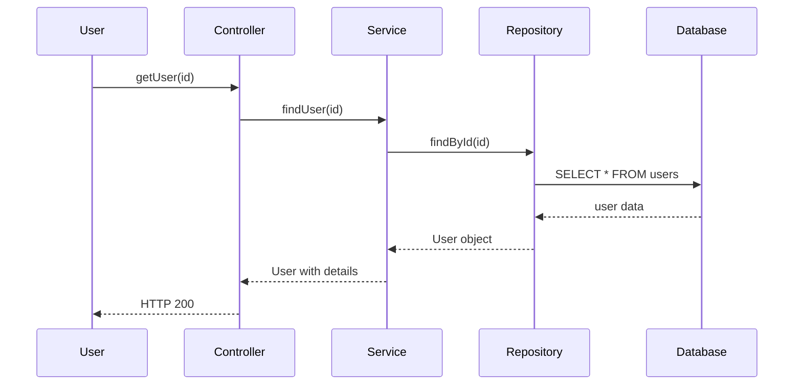

# CSA GUI 화면 설계서 - 다이어그램 뷰어

**페이지**: Diagrams (Results)
**경로**: /results/:projectId/diagrams
**사용자**: 모두

---

## 페이지 개요

시퀀스, CRUD 매트릭스, 호출 체인 등 다양한 형식의 다이어그램을 뷰어로 제공합니다.

---

## 레이아웃

```
┌───────────────────────────────────────────────────┐
│ Diagrams                 [Project: car-center-dev] │
├───────────────────────────────────────────────────┤
│                                                   │
│ [Sequence] [CRUD Matrix] [Call Chain] [Class]    │
│                                                   │
├───────────────────────────────────────────────────┤
│                                                   │
│ Sequence Diagram                                 │
│                                                   │
│ ┌──────────────────────────────────────────────┐ │
│ │ 🔍 Search: [_____] 🖨️ 📊 ⬇️ 🔄              │ │
│ ├──────────────────────────────────────────────┤ │
│ │                                              │ │
│ │   User          Controller      Service      │ │
│ │    │               │              │         │ │
│ │    │───request────→│              │         │ │
│ │    │               │───call────→  │         │ │
│ │    │               │              │─db──→   │ │
│ │    │               │              │←─data   │ │
│ │    │               │←─return──────│         │ │
│ │    │←─response─────│              │         │ │
│ │    │               │              │         │ │
│ │                                              │ │
│ └──────────────────────────────────────────────┘ │
│                                                   │
│ [Full Screen] [Export as PNG] [Export as SVG]   │
│                                                   │
└───────────────────────────────────────────────────┘
```

---

## 탭별 상세 설계

### 1. Sequence Diagram

**특징**:
- Mermaid.js 기반 시퀀스 다이어그램
- 클래스/메서드 호출 순서 표시
- 검색 및 필터링
- 확대/축소

```html
<SequenceDiagramTab>
  <Toolbar>
    <Select
      v-model="selectedClass"
      placeholder="클래스 선택"
      filterable
    />
    <Select
      v-model="selectedMethod"
      placeholder="메서드 선택"
      filterable
    />
    <InputNumber
      v-model="maxDepth"
      label="Max Depth"
      :min="1"
      :max="10"
    />
    <Button type="primary" @click="generateDiagram">
      Generate
    </Button>
  </Toolbar>

  <div class="diagram-container">
    <Mermaid :diagram="mermaidDiagram" />
  </div>

  <Toolbar align="right">
    <Button @click="exportAsImage('png')">
      Export as PNG
    </Button>
    <Button @click="exportAsImage('svg')">
      Export as SVG
    </Button>
    <Button @click="copyToClipboard">
      Copy to Clipboard
    </Button>
  </Toolbar>
</SequenceDiagramTab>
```

**예시 다이어그램**:



### 2. CRUD Matrix

**특징**:
- 테이블별 CRUD 작업 매핑
- 상호작용 가능한 행렬
- 색상 코딩
- 정렬 및 필터링

```html
<CrudMatrixTab>
  <Toolbar>
    <Select
      v-model="sortBy"
      placeholder="정렬"
    >
      <Option value="table">Table Name</Option>
      <Option value="ops">Operations</Option>
      <Option value="classes">Classes</Option>
    </Select>
    <Input v-model="filterText" placeholder="필터..." />
  </Toolbar>

  <Table
    :columns="columns"
    :dataSource="crudData"
    bordered
    size="small"
  >
    <template #bodyCell="{ column, record }">
      <div v-if="column.key === 'create'" :class="getOpClass(record.create)">
        {{ record.create ? 'C' : '-' }}
      </div>
      <div v-else-if="column.key === 'read'" :class="getOpClass(record.read)">
        {{ record.read ? 'R' : '-' }}
      </div>
      <div v-else-if="column.key === 'update'" :class="getOpClass(record.update)">
        {{ record.update ? 'U' : '-' }}
      </div>
      <div v-else-if="column.key === 'delete'" :class="getOpClass(record.delete)">
        {{ record.delete ? 'D' : '-' }}
      </div>
      <div v-else-if="column.key === 'classes'">
        <Tag>{{ record.classCount }}</Tag>
      </div>
    </template>
  </Table>

  <div class="legend">
    <Tag color="green">CREATE</Tag>
    <Tag color="blue">READ</Tag>
    <Tag color="orange">UPDATE</Tag>
    <Tag color="red">DELETE</Tag>
  </div>

  <Toolbar align="right">
    <Button @click="exportToExcel">Export to Excel</Button>
  </Toolbar>
</CrudMatrixTab>
```

**데이터 예시**:

| Table | CREATE | READ | UPDATE | DELETE | Classes |
|-------|--------|------|--------|--------|---------|
| USER | ✓ | ✓ | ✓ | ✓ | UserService, UserController |
| ORDER | ✓ | ✓ | ✓ | ✓ | OrderService, OrderController |
| PAYMENT | ✗ | ✓ | ✗ | ✗ | PaymentService |

### 3. Call Chain

**특징**:
- 호출 체인 시각화
- 트리/그래프 형식
- 드릴다운 가능
- 깊이 제한

```html
<CallChainTab>
  <Toolbar>
    <Select
      v-model="startPoint"
      placeholder="시작점 선택"
      filterable
    />
    <InputNumber
      v-model="maxDepth"
      label="Max Depth"
      :min="1"
      :max="15"
    />
    <Button type="primary" @click="generateChain">
      Generate
    </Button>
  </Toolbar>

  <Tree
    :data="callChainTree"
    :loadMore="expandNode"
    defaultExpandAll
  >
    <template #title="{ node }">
      <span :class="`node-type-${node.type}`">
        {{ node.label }}
      </span>
      <Tag v-if="node.complexity" color="orange">
        {{ node.complexity }}
      </Tag>
    </template>
  </Tree>
</CallChainTab>
```

### 4. Class Diagram

**특징**:
- PlantUML 클래스 다이어그램
- 상속 관계
- 메서드/필드 표시
- 패키지 구조

```html
<ClassDiagramTab>
  <Toolbar>
    <Select
      v-model="selectedPackage"
      placeholder="패키지 선택"
      filterable
    />
    <Checkbox v-model="showMethods">Show Methods</Checkbox>
    <Checkbox v-model="showFields">Show Fields</Checkbox>
    <Button type="primary" @click="generateDiagram">
      Generate
    </Button>
  </Toolbar>

  <div class="diagram-container">
    <PlantUML :diagram="plantUMLDiagram" />
  </div>

  <Toolbar align="right">
    <Button @click="exportAsImage('png')">Export</Button>
  </Toolbar>
</ClassDiagramTab>
```

---

## 공통 기능

### 줌/팬 컨트롤

```html
<div class="diagram-controls">
  <Button
    icon="zoom-in"
    @click="zoom(1.2)"
  />
  <Button
    icon="zoom-out"
    @click="zoom(0.8)"
  />
  <Button
    icon="fit"
    @click="fitDiagram"
  />
  <Button
    icon="fullscreen"
    @click="toggleFullscreen"
  />
</div>
```

### 내보내기

```javascript
const exportAsImage = (format) => {
  if (format === 'png') {
    // Mermaid/PlantUML → PNG 변환
    diagram.exportAsImage('png').then(blob => {
      downloadFile(blob, `diagram.png`)
    })
  }
}

const downloadFile = (blob, filename) => {
  const url = URL.createObjectURL(blob)
  const link = document.createElement('a')
  link.href = url
  link.download = filename
  link.click()
}
```

---

## 데이터 구조

```typescript
interface DiagramData {
  type: 'sequence' | 'crud' | 'call_chain' | 'class'
  content: string // Mermaid/PlantUML 코드
  metadata: {
    title: string
    description?: string
    classes?: string[]
    tables?: string[]
    generatedAt: Date
  }
}

interface CrudEntry {
  table: string
  create: boolean
  read: boolean
  update: boolean
  delete: boolean
  classes: string[]
}

interface CallChainNode {
  id: string
  label: string
  type: 'class' | 'method'
  complexity?: number
  children: CallChainNode[]
}
```

---

## Vue 컴포넌트

```vue
<template>
  <div class="diagrams-page">
    <Tabs v-model:activeKey="activeTab">
      <TabPane key="sequence" tab="Sequence">
        <SequenceDiagramTab />
      </TabPane>
      <TabPane key="crud" tab="CRUD Matrix">
        <CrudMatrixTab />
      </TabPane>
      <TabPane key="call-chain" tab="Call Chain">
        <CallChainTab />
      </TabPane>
      <TabPane key="class" tab="Class Diagram">
        <ClassDiagramTab />
      </TabPane>
    </Tabs>
  </div>
</template>

<script setup>
import { ref } from 'vue'

const activeTab = ref('sequence')
</script>
```

---

## 다음 문서

- `06-impact-analysis.md`: 영향도 분석 화면 설계
